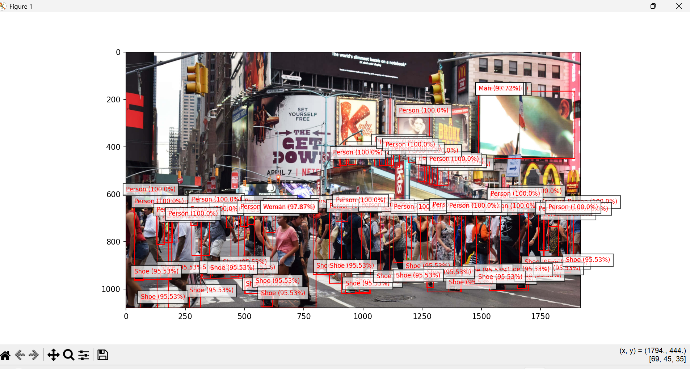
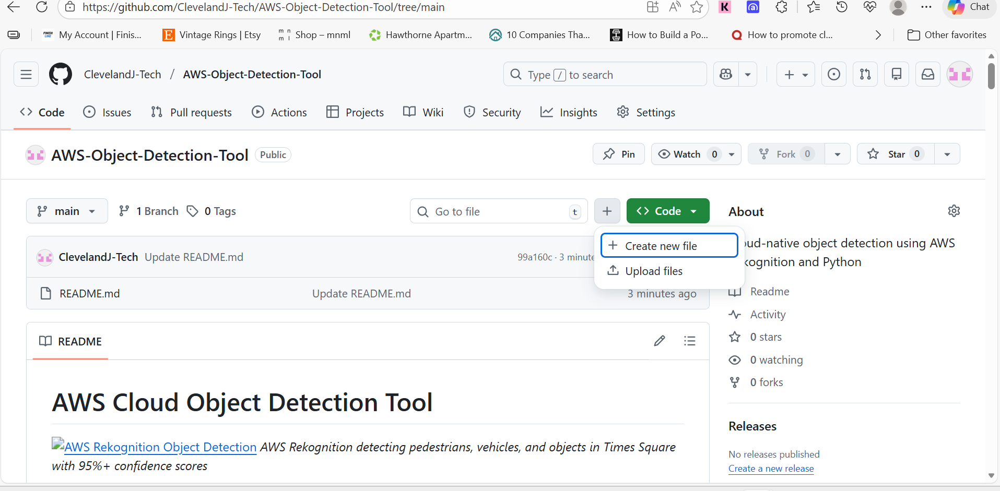
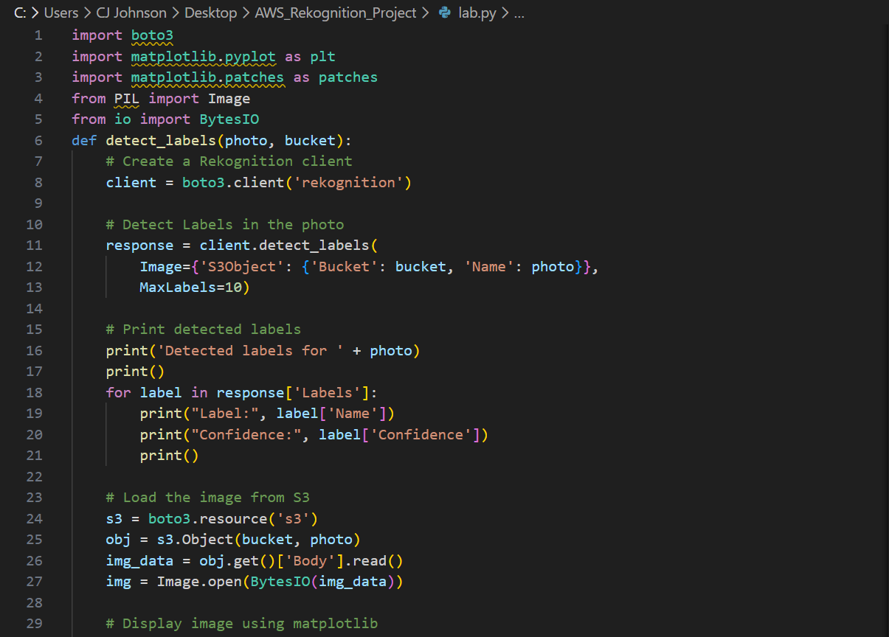

# AWS Cloud Object Detection Tool


*AWS Rekognition detecting pedestrians, vehicles, and objects in Times Square with 95%+ confidence scores*

---

## 📌 Project Overview

A cloud-native **Computer Vision application** that automatically identifies and labels objects within images using **Amazon Web Services (AWS)**. This project demonstrates hands-on cloud architecture, API integration, and security best practices by leveraging **AWS Rekognition's** deep learning neural network for real-time image analysis.

**What it does:**
- Retrieves images from a secure AWS S3 bucket
- Sends them to AWS Rekognition API for AI-powered analysis
- Returns detected objects with confidence scores and bounding box coordinates
- Visualizes results by drawing labeled boxes around detected entities

---

## 🎯 Skills Demonstrated

| Category | Skills |
|----------|--------|
| ☁️ **Cloud Architecture** | AWS S3 storage, AWS Rekognition AI/ML service integration |
| 🔐 **Security** | IAM least-privilege access controls, credential management |
| 🐍 **Python Development** | Boto3 SDK, API orchestration, error handling |
| 📊 **Data Visualization** | Matplotlib and Pillow libraries for rendering analytical overlays |
| 🤖 **AI/ML Integration** | Working with cloud-based neural networks and JSON responses |

---

## 🏗️ Architecture

### System Workflow

```
1. Image Upload → AWS S3 Bucket (aws-rekognition-map-images)
2. Python Script → Authenticates via AWS CLI credentials
3. API Call → Sends S3 object key to Rekognition
4. AI Analysis → AWS returns JSON with labels, confidence scores, coordinates
5. Visualization → Script parses data and draws bounding boxes on image
```

### AWS Services Used


*S3 bucket containing test images for analysis*

**Key AWS Services Used:**
- **Amazon S3** - Secure object storage for images
- **Amazon Rekognition** - AI-powered computer vision service
- **AWS IAM** - Identity and access management for security

---

## 💻 Code Implementation

### Core Functionality


*Python script using Boto3 to interface with AWS Rekognition API*

### Key Code Sections

**1. Rekognition API Call**
```python
# Connect to AWS Rekognition service
client = boto3.client('rekognition')

# Send image for analysis
response = client.detect_labels(
    Image={'S3Object': {'Bucket': bucket, 'Name': photo}},
    MaxLabels=10
)
```

**2. Processing Detection Results**
```python
# Parse detected labels
for label in response['Labels']:
    print("Label:", label['Name'])
    print("Confidence:", label['Confidence'])
```

**3. Image Retrieval from S3**
```python
# Load image from S3 bucket
s3 = boto3.resource('s3')
obj = s3.Object(bucket, photo)
img_data = obj.get()['Body'].read()
img = Image.open(BytesIO(img_data))
```

**4. Bounding Box Visualization**
```python
# Draw detection boxes on image
for label in response['Labels']:
    for instance in label.get('Instances', []):
        box = instance['BoundingBox']
        # Calculate pixel coordinates and draw rectangle
        # Add label text with confidence score
```

---

## 🔒 Security Implementation

### IAM Policy Configuration

**Principle:** Least-Privilege Access Model

**Permissions Granted:**
- ✅ `s3:GetObject` - Read-only access to specific S3 bucket
- ✅ `rekognition:DetectLabels` - Limited to object detection operations only

**Permissions Denied:**
- ❌ No write/delete permissions on S3
- ❌ No access to other AWS services
- ❌ No access to other S3 buckets

### Security Best Practices Applied

1. **Credential Management**
   - AWS credentials stored in AWS CLI configuration
   - No hardcoded credentials in source code
   - Uses AWS credential provider chain

2. **Data Protection**
   - S3 bucket encryption at rest enabled
   - HTTPS for all API communications
   - Temporary security tokens where applicable

3. **Access Control**
   - IAM user with minimal required permissions
   - Bucket policies restrict access to authorized users only
   - CloudTrail logging enabled for audit trail

---

## 📋 Prerequisites

### Required Software
- **AWS Account** with programmatic access enabled
- **Python 3.x** installed
- **AWS CLI** configured with credentials
- **Git** (for cloning the repository)

### Required Python Libraries
```bash
pip install boto3 matplotlib pillow
```

### AWS Configuration
```bash
# Configure AWS credentials
aws configure

# Required inputs:
# - AWS Access Key ID
# - AWS Secret Access Key
# - Default region (e.g., us-east-1)
# - Output format (json)
```

---

## 🚀 How to Run the Project

### Step 1: Clone the Repository
```bash
git clone https://github.com/ClevelandJ-Tech/AWS-Object-Detection-Tool.git
cd AWS-Object-Detection-Tool
```

### Step 2: Set Up AWS Resources

**Create S3 Bucket:**
```bash
aws s3 mb s3://your-bucket-name
```

**Upload Test Image:**
```bash
aws s3 cp your-image.jpg s3://your-bucket-name/
```

### Step 3: Update Configuration

Edit the Python script to specify your bucket and image:
```python
bucket = 'your-bucket-name'
photo = 'your-image.jpg'
```

### Step 4: Run the Detection
```bash
python lab.py
```

### Step 5: View Results
- Console output will show detected labels and confidence scores
- Matplotlib window will display the annotated image with bounding boxes

---

## 📊 Sample Output

**Console Output:**
```
Detected labels for times-square-4k.jpg

Label: Person
Confidence: 100.0%

Label: Man
Confidence: 97.72%

Label: Shoe
Confidence: 95.53%

Label: Car
Confidence: 98.45%
```

**Visual Output:**
- Image displayed with color-coded bounding boxes
- Labels showing object type and confidence percentage
- Coordinate system overlay for precise localization

---

## 💡 Challenges & Solutions

| Challenge | Solution |
|-----------|----------|
| **Initial IAM permissions too broad** | Refined policy to follow least-privilege principle, limiting to only required actions |
| **Handling overlapping bounding boxes** | Adjusted visualization transparency (alpha) and label positioning to improve readability |
| **Processing large images** | Implemented error handling for API limits and added image resizing option |
| **Managing API costs** | Added checks to estimate costs before processing and limited MaxLabels parameter |

---

## 📈 Key Takeaways

### Technical Learnings
- ✅ Designed secure cloud architecture with AWS best practices
- ✅ Implemented IAM least-privilege security model
- ✅ Integrated Python with AWS services using Boto3 SDK
- ✅ Parsed and visualized complex JSON API responses
- ✅ Handled errors and edge cases in cloud applications

### Cloud Security Skills
- Understanding IAM roles, policies, and permissions
- Implementing secure credential management
- Applying defense-in-depth security principles
- Cost-effective cloud resource management

### Professional Development
- Documentation and project presentation
- Version control with Git and GitHub
- Technical writing and communication
- Creating portfolio-ready projects

---

## 💰 Cost Analysis

**AWS Free Tier Eligible:**
- First 5,000 images per month are free with AWS Rekognition
- S3 storage: First 5 GB free

**Estimated Costs (Beyond Free Tier):**
- **Rekognition:** $1.00 per 1,000 images analyzed
- **S3 Storage:** ~$0.023 per GB/month
- **Data Transfer:** First 100 GB free per month

**Total Project Cost:** < $1.00 (for testing and development)

---

## 🔮 Future Enhancements

### Planned Features
- [ ] **Batch Processing** - Analyze multiple images in one operation
- [ ] **Real-Time Video Analysis** - Extend to video stream processing
- [ ] **Web Interface** - Create user-friendly upload and visualization portal
- [ ] **Facial Recognition** - Add face detection and comparison features
- [ ] **CloudWatch Integration** - Implement monitoring and alerting
- [ ] **Lambda Function** - Convert to serverless architecture
- [ ] **Database Storage** - Save detection results to DynamoDB
- [ ] **RESTful API** - Expose functionality as an API endpoint

### Scalability Improvements
- Implement caching for frequently analyzed images
- Add CloudFront CDN for faster image delivery
- Use SQS for asynchronous processing queue
- Implement auto-scaling for high-volume scenarios

---

## 📚 Resources & Documentation

### AWS Documentation
- [AWS Rekognition Developer Guide](https://docs.aws.amazon.com/rekognition/)
- [AWS S3 Documentation](https://docs.aws.amazon.com/s3/)
- [AWS IAM Best Practices](https://docs.aws.amazon.com/IAM/latest/UserGuide/best-practices.html)

### Python Libraries
- [Boto3 Documentation](https://boto3.amazonaws.com/v1/documentation/api/latest/index.html)
- [Matplotlib Documentation](https://matplotlib.org/)
- [Pillow (PIL) Documentation](https://pillow.readthedocs.io/)

---

---

## 🔗 Related Projects

[← Back to Main Portfolio](https://github.com/ClevelandJ-Tech)

---

**Tech Stack:** 


